# phage-rs
A lightweight Linux runtime security sensor and research tool written in Rust and eBPF. EDR, basically. 

phage-rs monitors critical system activity directly from the Linux kernel (process execution, filesystem changes, network events, and kernel module loading), computes streaming BLAKE3 cryptographic signatures of running binaries, and evaluates behavioral rules to detect and stop suspicious activity in real time.

---

## How It Works (At least, for now)
* **Kernel Telemetry (eBPF):** Hooks `sys_enter_execve` and other syscalls using Aya. Captures process ID, user ID, process name, executable path, and arguments.
* **Zero-Copy Ring Buffer:** Transfers structured events from the kernel to userspace through a lock-free eBPF `RingBuf` with in-place writing.
* **Cryptographic Hashes (BLAKE3):** Hashes executed files on the fly using streaming BLAKE3 to generate a unique digital signature for every launched process.
* **Metadata-Aware LRU Cache:** Avoids repeated disk I/O by caching file hashes against `(inode, ctime, size)`. If a file is modified on disk (or its timestamp is tampered with), the cache automatically invalidates.
* **Local Behavioral Rules:** Performs basic heuristic checks before execution proceeds, terminating suspicious processes with `SIGKILL` (e.g., shells spawned by web servers or binaries executed directly from `/dev/shm` / `/tmp`).

---

## Current Behavioral Checks
| Rule | Trigger Condition | Action |
| :--- | :--- | :--- |
| **Web-Server Shell (MITRE T1505.003)** | `nginx`, `apache`, or `caddy` spawning an interactive shell (`sh`, `bash`, `dash`). | `SIGKILL` |
| **In-Memory Payload (MITRE T1027.004)** | Executables launched from `/dev/shm/`, `/tmp/`, `/var/tmp/`, or `memfd:`. | `SIGKILL` |
| **Tampering Detection (MITRE T1070.006)** | Checks kernel `ctime` and `inode` changes to catch modified files. | Cache Miss & Re-hash |

---

## Observed Local Footprint
Measurements taken during local runs on Linux x86_64 with poor little Ryzen 5 2400G:
* **Userspace Memory:** ~26 MB
* **CPU Usage:** ~0.0% idle / minimal overhead under execution bursts
* **Kernel Probe Size:** under 600 bytes JIT machine code
* **Cache Hit Latency:** ~3 - 15 µs
* **File Hashing:** ~80 - 150 µs

---

## Architecture
Current plans. Only local part implemented for 0.0.1 release. Can be changed in future also. 

```mermaid
flowchart TD
    subgraph Host ["Linux Host (phage-agent)"]
        subgraph Kernel ["Kernel Space (Ring 0 - L1 Cache)"]
            EBPF["eBPF Probe"]
            RING[("RingBuf (256 KB)")]
            EBPF -->|Zero-Copy Write| RING
        end

        subgraph Agent ["Userspace Daemon"]
            TOKIO["Tokio Event Consumer"]
            DETECTOR{"Behavioral Engine"}
            KILL["Immediate SIGKILL"]
            CACHE{"LRU FileCache<br/>(ino, ctime, size)"}
            HASHER["Streaming BLAKE3 Hasher"]
            CLIENT["gRPC Client (Tonic)"]

            RING -->|epoll Wakeup| TOKIO
            TOKIO --> DETECTOR
            DETECTOR -->|Threat Detected| KILL
            DETECTOR -->|Allowed| CACHE
            CACHE -->|🟢 Cache HIT| CLIENT
            CACHE -->|🔴 Cache MISS / Modified| HASHER
            HASHER --> CLIENT
        end
    end

    subgraph L1 ["Server L1 (Orchestration & Threat Intelligence)"]
        GW["gRPC Gateway"]
        BLOOM[("In-Memory Threat Filter<br/>(Bloom Filter / Redis)")]
        RABBIT[["RabbitMQ Task Queue"]]
        PG[("PostgreSQL Metadata & Audit")]
        MINIO[("MinIO S3 Quarantine Storage")]

        CLIENT --> GW
        GW <--> BLOOM
        GW --> RABBIT
        GW <--> PG
        GW --> MINIO
    end

    subgraph Backend ["Deep Analysis & Long-term Analytics"]
        subgraph Workers ["Worker Engine Cluster"]
            W_ENG["Async Worker Pool"]
            YARA["YARA Rule Engine"]
            RABBIT --> W_ENG
            W_ENG <--> YARA
            W_ENG --> PG
        end

        subgraph L2 ["Server L2 (Global Analytics)"]
            CH[("ClickHouse")]
            GRAPH["Process Lineage Graph"]
            PG --> CH
            GW -.-> GRAPH
        end
    end

    style Kernel fill:#0d1117,stroke:#00f5ff,stroke-width:2px
    style Agent fill:#161b22,stroke:#58a6ff,stroke-width:1px
    style EBPF fill:#00f5ff22,stroke:#00f5ff,stroke-width:2px
    style KILL fill:#ff005533,stroke:#ff0055,stroke-width:2px
    style CACHE fill:#2ea04322,stroke:#2ea043,stroke-width:2px
    style L1 fill:#141b2b,stroke:#63d1bc,stroke-width:1px
    style Workers fill:#1a102f,stroke:#a855f7,stroke-width:1px
    style L2 fill:#0b0f19,stroke:#e3b341,stroke-width:1px
```


## Building & Running
### Requirements
* Linux Kernel `>= 5.8` (with eBPF / BTF enabled)
* Rust Nightly toolchain
* `bpf-linker` (`cargo install bpf-linker`)
### Run
```bash
# Build
cargo build --release -p phage-agent
# Run agent with root privileges
sudo ./target/release/phage-agent
```

## License
Under AGPLv3.0 license and eBPF probe is under GPL
