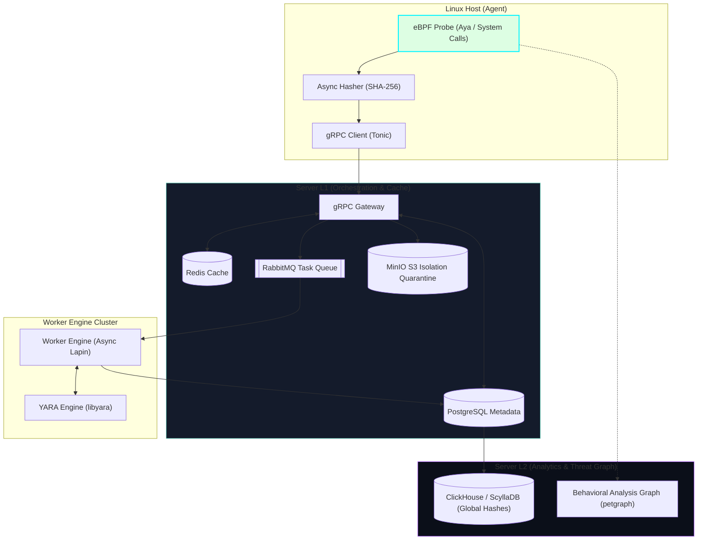

# phage-rs
An open-source, lightweight cloud-native antivirus framework featuring eBPF-based kernel monitoring, gRPC streaming, and RabbitMQ.

```mermaid
graph TD
    subgraph Client ["Linux Host (Agent)"]
        EBPF["eBPF Probe (Aya / System Calls)"]
        HASH["Async Hasher (SHA-256)"]
        GRPC_C["gRPC Client (Tonic)"]
        EBPF --> HASH --> GRPC_C
    end

    subgraph L1 ["Server L1 (Orchestration & Cache)"]
        GW["gRPC Gateway"]
        REDIS[("Redis Cache")]
        RABBIT[["RabbitMQ Task Queue"]]
        PG[("PostgreSQL Metadata")]
        MINIO[("MinIO S3 Isolation Quarantine")]
        
        GRPC_C --> GW
        GW <--> REDIS
        GW --> RABBIT
        GW <--> PG
        GW --> MINIO
    end

    subgraph Workers ["Worker Engine Cluster"]
        W_ENG["Worker Engine (Async Lapin)"]
        YARA["YARA Engine (libyara)"]
        
        RABBIT --> W_ENG
        W_ENG <--> YARA
        W_ENG --> PG
    end

    subgraph L2 ["Server L2 (Analytics & Threat Graph)"]
        CH[("ClickHouse / ScyllaDB (Global Hashes)")]
        GRAPH["Behavioral Analysis Graph (petgraph)"]
        
        PG --> CH
        EBPF -.-> GRAPH
    end

    style EBPF fill:#00f5ff22,stroke:#00f5ff,stroke-width:2px
    style L1 fill:#141b2b,stroke:#63d1bc,stroke-width:1px
    style L2 fill:#0b0f19,stroke:#a855f7,stroke-width:1px
```
